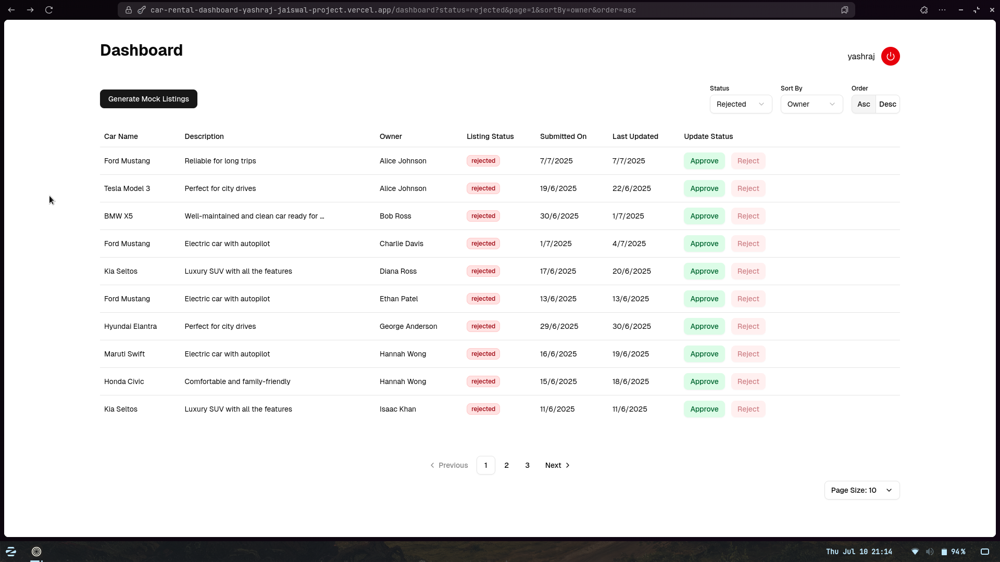
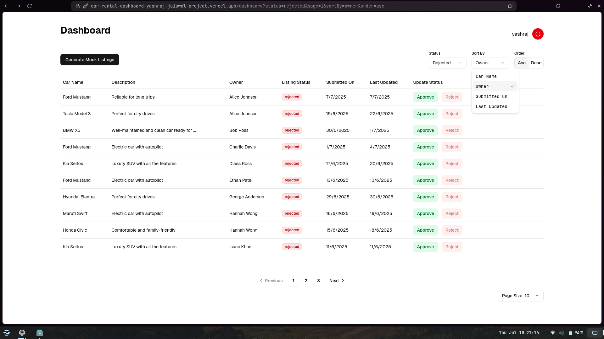
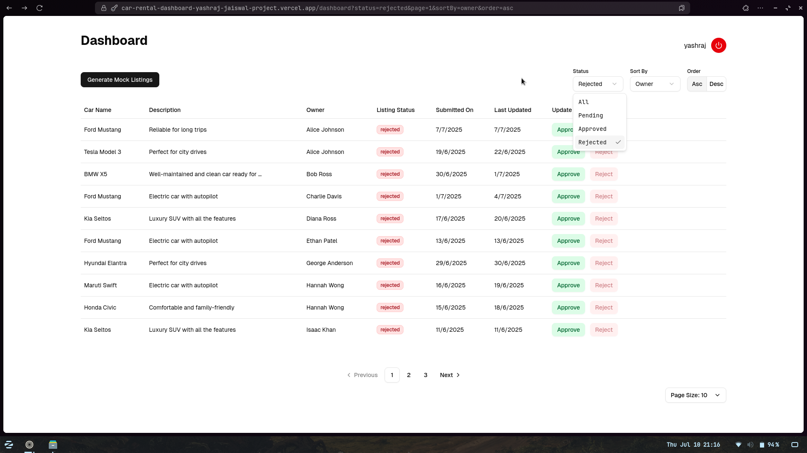
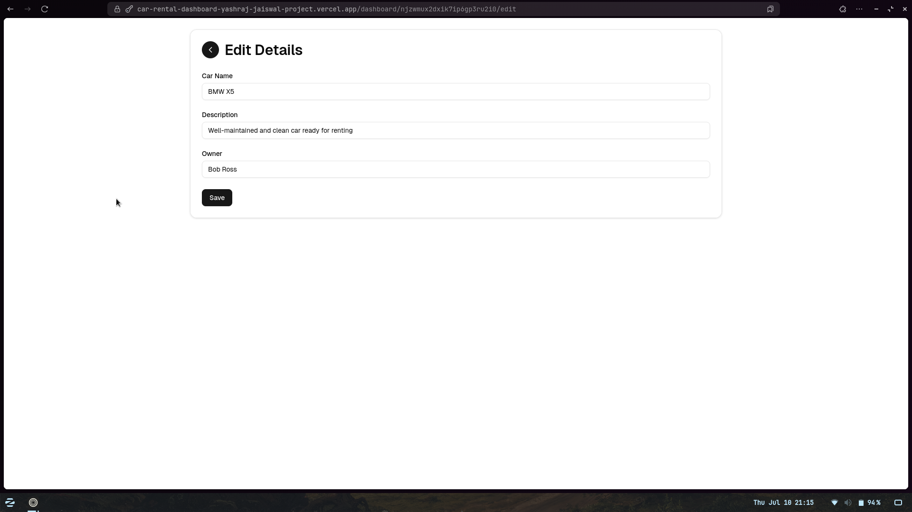
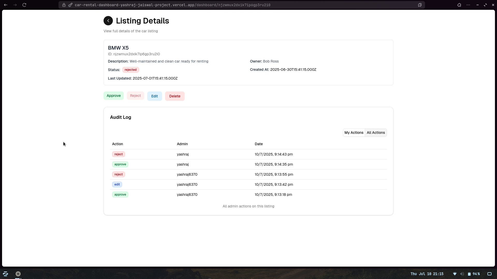

# Car Rental Listings Admin Dashboard

[Live Demo](https://car-rental-dashboard-yashraj-jaiswal-project.vercel.app)

This project is an internal admin dashboard for reviewing, approving, rejecting, and editing car rental listings submitted by users. It was built as part of a technical assessment to demonstrate proficiency with Next.js, React, API integration, and clean UI/UX practices.

## 🎥 Demo Video

## Features

- **Login & Authentication**: Secure login (email & password, with registration on first sign-in), using NextAuth.
- **Dashboard**: Paginated, sortable table view of all car rental listings, fetched from an API (SQLite-backed).
- **Actionable Table**: Each listing row provides Approve, Reject, Edit, and Delete actions. Approve/Reject update listing status immediately.
- **Edit Listings**: Editing opens a form with pre-filled data for updating car name, description, or owner.
- **Generate Mock Listings**: Quickly populate the database with demo data for easy testing.
- **Sorting & Pagination**: Easily sort listings by Car Name, Owner, Status, Submission date, or Last update. Pagination ensures performance with many listings.
- **Feedback Messaging**: Uses React Context & hooks to display success/error toasts on actions.
- **Route Protection**: All dashboard and API routes require authentication; unauthenticated users are redirected to login.
- **Responsive Design**: TailwindCSS ensures a mobile- and desktop-friendly UI with accessible components.

## Stretch Goals

- [x] Filtering by listing status (approved, pending, rejected)
- [x] Audit trail/logging
- [x] Performance optimizations (uses React Query, only re-renders changed rows)
- [x] Vercel deployment instructions

## Tech Stack

- **Framework:** Next.js (with SSR, API routes, and getServerSideProps)
- **UI:** TailwindCSS, Radix UI (for components)
- **State management:** React Context API, React Query
- **Database:** Drizzle ORM with SQLite
- **Authentication:** NextAuth.js (credentials provider, secure JWT)
- **Validation:** Zod schemas, React Hook Form

## Directory Structure

- `src/pages/` — Next.js pages (login, dashboard, API routes)
- `src/components/` — Reusable UI components (listing table, edit form, etc.)
- `src/hooks/` — Custom React hooks for listings logic
- `src/lib/` — Utilities, types, db queries
- `src/constants/` — Constants and enums
- `src/styles/` — Global styles (Tailwind)

## Assessment Task

This project was built to solve the following assessment:

> **Task:** Build a Custom Admin Dashboard for Managing User-Generated Car Rental Listings. Admins can review, approve, reject, or edit listings. Use Next.js , protect routes, use React Context, TailwindCSS, sorting, pagination, and filtering. See `/login` to begin.

---

## 📸 Screenshots

### 🖥️ Dashboard Page

### 🔽 Sort Dropdown on Dashboard

### ✅ Status Filter on Dashboard

### ✏️ Edit Listing Form

### 📑 Listing Details with Audit Logs

